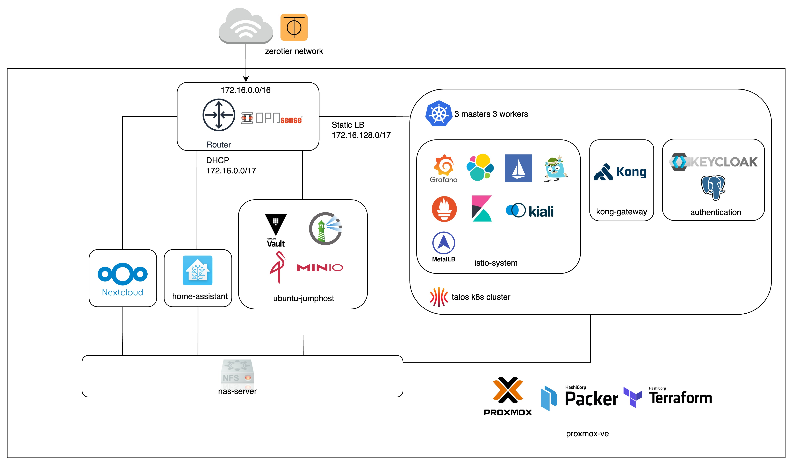

# home-server

[](https://github.com/guyzsarun/home-server/actions/workflows/main.yml) 
[](https://github.com/guyzsarun/home-server/actions/workflows/healthcheck.yml)

Proxmox Virtual Environment (Proxmox VE) for running VMs and Kubernetes Cluster provisioned using Terraform and Ansible.


## Table of Contents

- [Diagram](#home-server-diagram)
- [Product Structure](#project-structure)
- [OPNsense Router](#opnsense-router)
- [Jumphost VM](#jumphost-vm)
- [Kubernetes Cluster](#kubernetes-cluster)
  - [Authentication](#authentication)
  - [Service Mesh / API Gateway](#service-mesh-and-api-gateway)
- [Terraform Diagram](#terraform-diagram)


## Home server Diagram




## Project Structure
```
.

```


## OPNsense Router
OPNsense router with zerotier plugin for VPC and DNS resolution

### Network Interface
| Interface | Network | Description | IP |
|-----------|---------|-------------|----|
| LAN       | vtnet0  |  Linux Bridge | 192.168.0.1/24 |
| OPT       | vtnet1  |  VM Network | 172.16.0.0/16 |
| OPT1      | zt0     | Zerotier Network | - |

### DNS Configuration

For DNS resolution, refer to [opnsense-configuration](https://github.com/guyzsarun-lab/opnsense-configuration) repository for Terraform template to override DNS configuration

### OPNsense Plugin Setup
1. Update OPNsense to the latest version `System > Firmware > Updates`
2. Install `os-qemu-guest-agent` and `os-zerotier `
3. Join Zerotier Network `VPN > Zerotier > Join Network`
4. Setup Network Interface or Import from previous backup


## Jumphost VM and Application Server ( Non - Kubernetes )
See [ansible](https://github.com/guyzsarun-lab/ansible) repository for more details on the playbook.


## Kubernetes Cluster
1. Provision [Talos](https://www.talos.dev/) Kubernetes vm

```
terraform -chdir=./terraform plan

terraform -chdir=./terraform apply -target module.talos-k8s
```
2. Bootstrap Kubernetes Cluster, refer to [talos](./terraform/talos/README.md) directory for more details

3. Apply Kubernetes cluster essentials ( metrics-server / loadbalancer / nfs storage provisioner )
```
terraform -chdir=./terraform apply -target module.kubernetes
```

4. Update the VM network LoadBalancer IP in `kubernetes/loadbalancer/metallb-address.yaml`
```
kubectl apply -f ./kubernetes/loadbalancer
```
### Authentication

Install Keycloak OIDC and PostgreSQL
```
kubectl apply -f ./kubernetes/db/postgres.yaml
kubectl apply -f ./kubernetes/keycloak/keycloak.yaml
```
Keycloak client for application available in `./kubernetes/keycloak/client`

### Addons
Apply base kubernetes addons
```
terraform -chdir=./terraform apply -target module.kubernetes-addons
```

### Service Mesh and  API Gateway

Install Mesh components and Patch Kong UI
```
kubectl apply -f ./kubernetes/monitoring/kiali.yaml 
kubectl apply -f ./kubernetes/monitoring/jaeger.yaml 

kubectl patch svc/kong-gateway-kong-manager --patch-file=./kubernetes/kong/kong-patch.yaml
```

### Monitoring
Install Elastic and Kibana
```
kubectl apply -f ./kubernetes/elk/elastic.yaml
kubectl apply -f ./kubernetes/elk/kibana.yaml
```

## Terraform Diagram

Generated using [rover](https://github.com/im2nguyen/rover)

